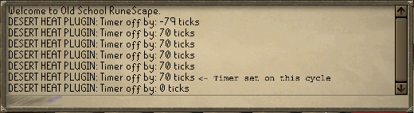
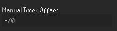
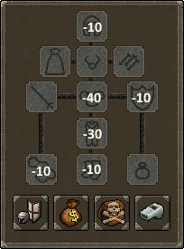

# Desert Heat 
Adds an overlay to help monitor water usage in areas with the [desert heat](https://oldschool.runescape.wiki/w/Desert_heat) effect.
######

## Config

- <b> Manual Timer Offset: </b> Offsets when the waterskin consumption timer resets. This is to be used if the gear you're wearing is missing/has been added incorrectly so the plugin will still be functional.
- <b> Show Offset Helper Messages: </b> Adds messages to chat to help user accurately adjust the manual offset.
- <b> Show Water Servings: </b> Toggles whether `Servings: __` is visible in the overlay.
- <b> Show Drain Rate: </b> Toggles whether `Drain Rate: every __` is visible in the overlay.
- <b> Show Time Left: </b> Toggles whether `Time Left: __` is visible in the overlay.
- <b> Show Drain Bar: </b> Toggles whether the `drain bar` is visible in the overlay.
- <b> Time Format: </b> Sets the overlay countdown timers to display in Ticks or Seconds.

## Using The Manual Timer Offset
Set the manual offset timer to the opposite of what the helper messages are saying. Typically,
the first message is inaccurate so let the helper messages run for a few cycles before setting
the offset timer. *(no offset is needed if the timer is only off by +1/-1 ticks).*

eg. If the offset timer looks like this:

then the manual offset in config options should look like this:

Effect of having "armour" items in each slot on the desert heat timer in ticks, base time is 150 ticks.

 
