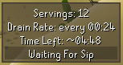
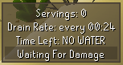
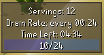
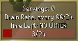

# Desert Heat 
Adds an overlay to help monitor water usage in areas with the [desert heat](https://oldschool.runescape.wiki/w/Desert_heat) effect
######

## Config

- <b> Manual Offset: </b> Offsets when the waterskin consumption timer resets.
- <b> Show Offset Messages: </b> Adds messages to chat to help user accurately adjust the manual offset.
- <b> Show Water Servings: </b> Toggles whether `Servings: __` is visible in the overlay.
- <b> Show Drain Rate: </b> Toggles whether `Drain Rate: every __` is visible in the overlay.
- <b> Show Time Left: </b> Toggles whether `Time Left: __` is visible in the overlay.
- <b> Show Drain Bar: </b> Toggles whether the drain bar is visible in the overlay.
- <b> Time Format: </b> Sets the overlay countdown timers to display in Ticks or Seconds.

## Limitations
The plugin depends on a list of items to calculate how quickly your water will drain, 
this list is not 100% accurate. Because of this you should take the calculated times with a grain of salt,
unless confirmed through your own use of the plugin.

## Support
If you're having to use the Manual Offset 
config option then some equipment is missing/has been added incorrectly. 
To fix this *(or to address any other issues)* create a [Github Issue](https://github.com/adam-bunce/desert-heat/issues) 
with a picture of your `Equipment` and the `offset helper chat messages`, or fill out [This Google Form](https://forms.gle/Y5YvxJsys2FuG6vW9) and I will fix it ASAP.
 