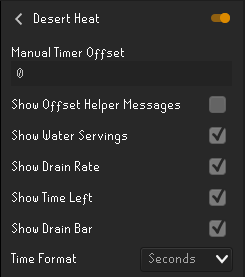

# Desert Heat 
Adds an overlay to help monitor water usage in areas with the [desert heat](https://oldschool.runescape.wiki/w/Desert_heat) effect
######

## Config

- <b> Manual Offset: </b> Offsets when the waterskin consumption timer resets. This is to be used if the gear you're wearing is missing/has been added incorrectly so the plugin will still be functional.
- <b> Show Offset Messages: </b> Adds messages to chat to help user accurately adjust the manual offset.
- <b> Show Water Servings: </b> Toggles whether `Servings: __` is visible in the overlay.
- <b> Show Drain Rate: </b> Toggles whether `Drain Rate: every __` is visible in the overlay.
- <b> Show Time Left: </b> Toggles whether `Time Left: __` is visible in the overlay.
- <b> Show Drain Bar: </b> Toggles whether the `drain bar` is visible in the overlay.
- <b> Time Format: </b> Sets the overlay countdown timers to display in Ticks or Seconds.

## Using The Manual Offset Timer
Set the manual offset timer to the opposite of what the helper messages are saying. Typically,
the first message is inaccurate so let the helper messages run for a few cycles before setting
the offset timer. *(no offset is needed if the timer is only off by +1/-1 ticks).*

eg. If the offset timer looks like this:

then the manual offset in config options should look like this:

## Limitations
The plugin depends on a list of items to calculate how quickly your water will drain, 
this list is not 100% accurate. Because of this you should take the calculated times with a grain of salt,
unless confirmed by your own use of the plugin.

## Support
If you're having to use the Manual Offset 
config option then some equipment is missing/has been added incorrectly. 
To fix this *(or to address any other issues)* create a [Github Issue](https://github.com/adam-bunce/desert-heat/issues) 
with a picture of your `equipment` and the `offset helper chat messages`, or fill out [This Google Form](https://forms.gle/Y5YvxJsys2FuG6vW9) and I will fix it ASAP.
 